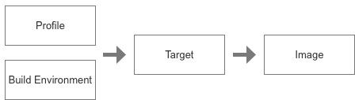

# PRESENTATION

Cookie is a complete cross compilation environment that is host agnostic and can run on most of the
OS out there. That includes Windows, Mac OS and of course the Linux distributions. It allows to
build firmware images for various platforms.

Cookie focus on Raspberry PI boards, that are widely available out there, but can be easily adapted
to work with other platforms. It provides different profiles that define what an image contains and
how to build it. These profiles serve both as an example to learn how to work with the environment
and as a base for customization to work on more complex creations.

Cookie is not an OS, in the sense of Raspbian or OpenElec. It is not installed directly on your
board and the image created with Cookie does not need to have a package manager. Instead, Cookie
is the package manager, and you have full control over what make up the firmware. In this sense it
is similar to Buildroot.

Cookie approach result in custom tailored images, that does what they were designed for and are not
cluttered with additional functionalities that you don't need. In addition, the infrastructure
allows for strict version control over the different components, allowing for easy reproductibility
and firmware cohesion.

To summarize, with cookie, you choose a set of packages you want to install, you create the image
that will contains all the binaries and libraries that are needed, and you deploy this image on a
board that can then be started straight away without any additional steps on the board itself.

# PREREQUISITES

Before working with cookie, you need to ensure the necessary dependencies are installed on your
system. Note that these are kept to the bare minimum as to ensure cookie can run on a wide variety
of systems. As of today, the following are required:

- git
- python
- docker
- console

These tools are available on most OS and are relatively easy to install and setup. Simply check
online for these component as they all come with installation guides.

# SETUP

With all the dependencies in place, the setup of cookie itself is also pretty straight forward. The
following setup is a one time operation. Once complete, the **cookie** command will be available
from the **console** of your system.

**Retrieve cookie source code**

The first step of setup consist in cloning this repository. Assuming you want to install the code in
the **/path/to/cookie** directory, the following command can be issued:

	> git clone https://github.com/nparcollet/cookie.git /path/to/cookie

**Setup the console environment**

The second and last step is about setting up the environment so that the **cookie** command is
accessible easily from anywhere in the console. Because the way to define these variables depends on
your host system, there is no universal command that can be used. For instance on Linux and Mac you
are more likely to have to add some **export** entries in the **~/.bash_profile** file. On Windows,
this is done throu the system settings applet. Following is the list of changes that are expected on
the environment:

	- **COOKIE=/path/to/cookie** is to point the location where the repository was cloned
	- **${COOKIE}/bin** is to be added to the **PATH** variable of the environment
	- **PYTHONPATH=$COOKIE/python** is to be defined so that cookie python modules can be loaded

## QUICKSTART

The actual process of going from the description of an image to actually generating this image and
flashing it onto the board is long and complex, however it can be summarized with the following
simple diagram:

With this in mind, you can create a demo image with the following commands:

	> cookie bootstrap update
	> cookie create demo rpi3b
	> cookie merge
	> cookie mkredist

The result of these 4 commands is a brand new image named **demo-rpi3b.img** located in the
**${COOKIE}/cache/images** directory. Please note that cookie job stop at the generation of the
image. There are already tools out there that can be used to put this image on an SDCard so that
it can be loaded by the PI board. I recomment the use of **etcher** (https://etcher.io), an easy to
use multiplatform tool used to flash images to SD cards.

**Note**: The execution of these commands might take a while, after all, we are compiling everything
from scratch, including the toolchain.

## DOCUMENTATION

There is a lot more to cookie than just following the quick start. It is highly recommended to read
the following documents in order to get a good grasp of what can be done and how. These documents
are ordered in a logical order and will drive you throu this journey:

[Build Environment](docs/BOOTSTRAP.md)

# XXX TO SORT XXX

# BOOTSTRAP

Cookie is now installed on your host environment. It does not matter whether it is Linux, Windows or
MacOS. However, to create images for the raspberry we will need a dedicated environment that will be
the same independently of your host. To do this we use Docker and a custom made image named
**cookie**. To trigger the creation of this image, one simply need to run the following command:

	> cookie bootstrap update

Under the hood this will setup the new image, which is basically a Debian distribution with all the
tools needed to work with a raspberry. Running this command might take a while (up to one hour). It
is a one time process thou. Once complete, you will have a brand new OS within your host,
specifically tailored for creating Pi images. You can actually access this environment manually
using the following command:

	> cookie shell

Cookie itself is accessible within this environment, and is bound with the host system as the
/opt/cookie directory. This shell is a complete Linux system that will behave as expected
by any Linux developer.

**IMPORTANT**: Accessing this environment is normally done for debugging purpose, as you wont be
creating a PI image manually from there. In particular, changes you make when accessing the
environment through the shell will be discarded once you exit it. This guarantee that the system
will remain sanitized, and one can freely experiment there.

# GUIDES

[Command Line Reference](docs/CMDLINE.md)
[Advanced usage information](docs/CMDLINE.md)
[Flashing an image to the board](docs/FLASHING.md)
[Managing and customizing the kernel](docs/KERNEL.md)
[Working with profiles](docs/PROFILES.md)
[The rules to create and use packages](docs/PACKAGES.md)
[Understanding cookie python module](docs/PYTHON.md)
[Targets ins and outs](docs/TARGETS.md)

# RECIPES

With a working environment at hands, that real work can now start. As stated previously, you won't
need to do anything manually in the shell in order to generate PI images. Instead, we used what is
called cookie recipes. This repository include several ready made recipes that can be used for
testing and get a taste of what can be done. Each recipe contains 2 parts:

- A list of packages that need to be installed
- Hardware specific packages and configuration

Most recipes will include basic packages that are required in any Linux system. That includes the
kernel, the boot scripts, the system drivers and so one. On top of this, one will normally just add
additional application that is expected to run, for instance a web server.

Recipes are stored in the **profile** directory of this repository. This is also where a user can
create new ones. Profiles can be listed with the following command:

	> cookie profile list
